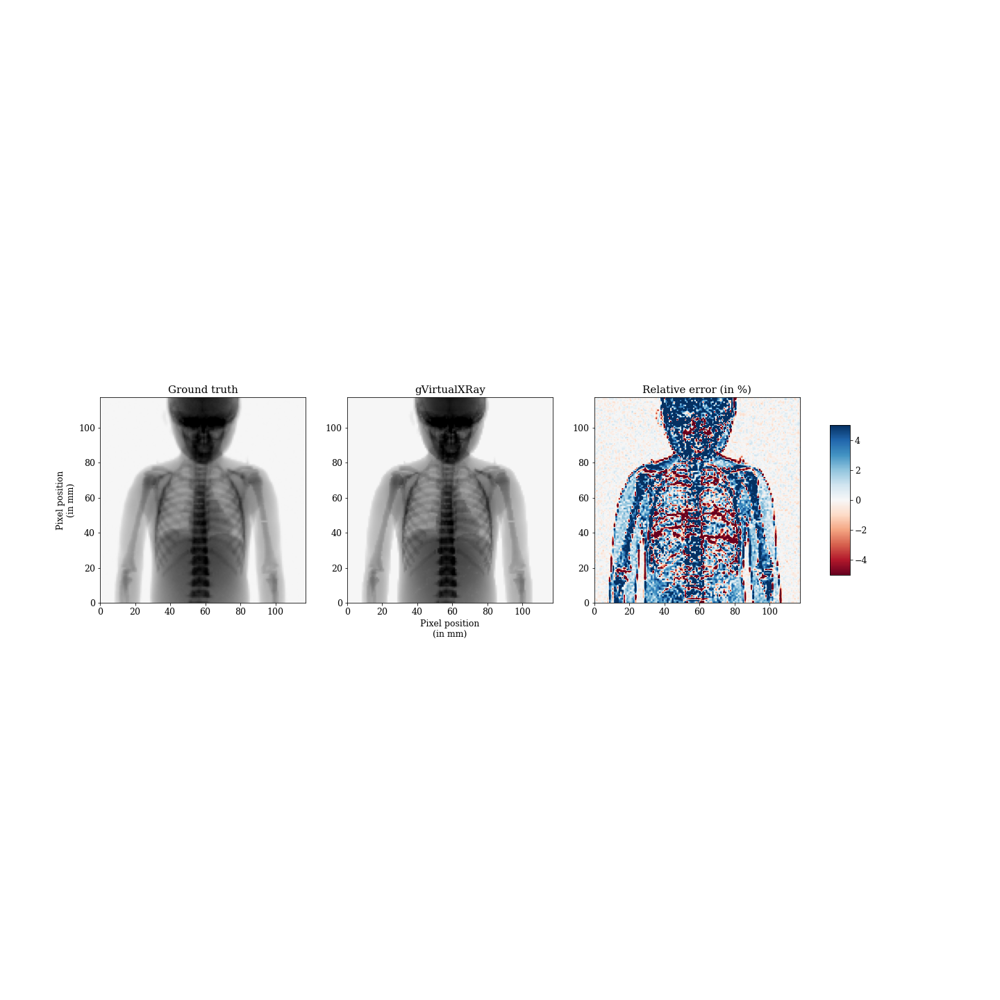
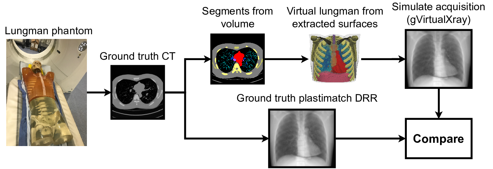
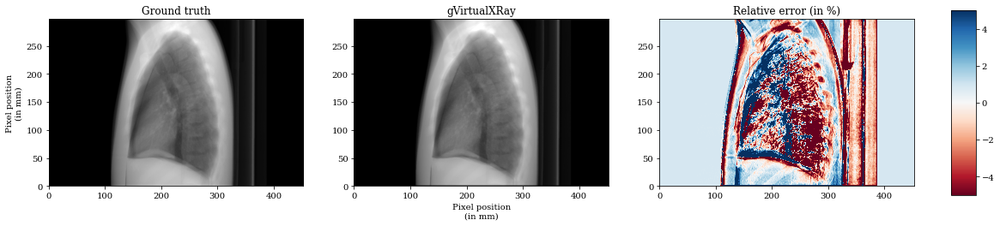
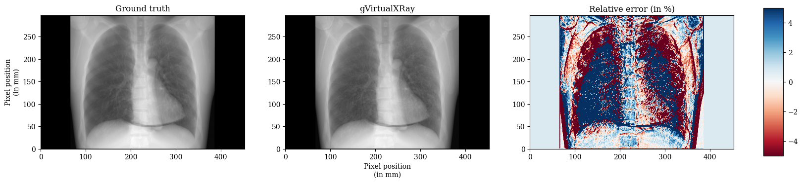
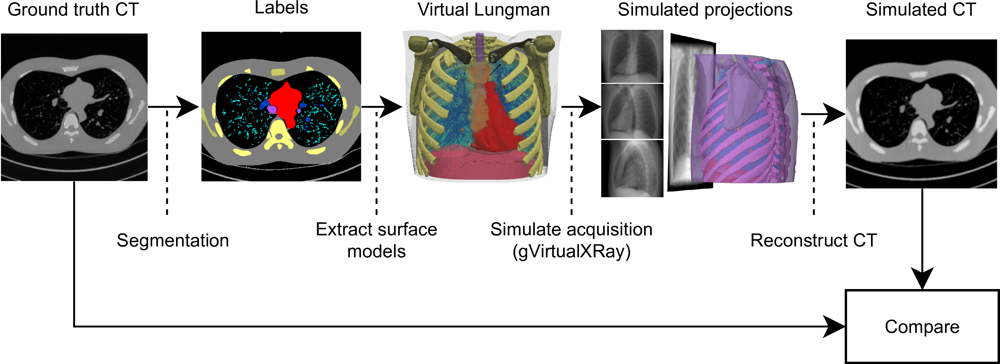
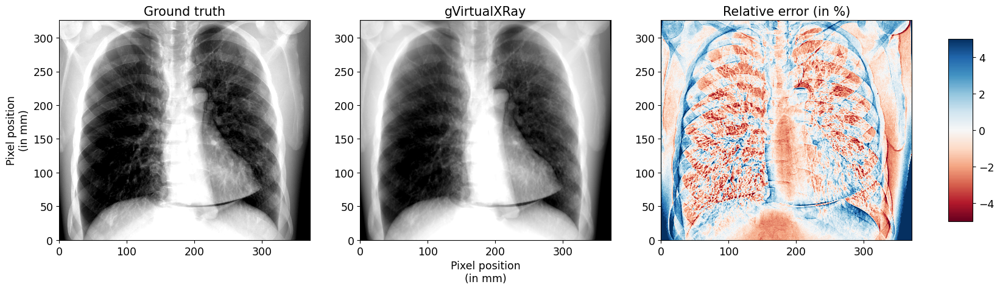

[](https://gvirtualxray.sourceforge.io/)

# gvxr-CMPB

**Simulation of X-ray projections on GPU: benchmarking [gVirtualXray](https://gvirtualxray.sourceforge.io/) with clinically realistic phantoms**

Jamie Lea Pointon<sup>a</sup>, Tianci Wen<sup>a</sup>, Jenna Tugwell-Allsup<sup>b</sup>, Aaron S&uacute;jar<sup>c,a</sup>, Jean Michel Létang<sup>d</sup>, Franck Patrick Vidal<sup>a,*</sup>

<i><sup>a</sup> School of Computer Science &amp; Electronic Engineering, Bangor University, UK</i>

<i><sup>b</sup> Radiology Department, Betsi Cadwaladr University Health Board (BCUHB), North Wales, Ysbyty Gwynedd, UK</i>

<i><sup>c</sup> Department of Computer Science, Universidad Rey Juan Carlos, Mostoles, Spain</i>

<i><sup>d</sup> Univ Lyon, INSA-Lyon, Université Claude Bernard Lyon 1, UJM-Saint &Eacute;tienne, CNRS, Inserm, CREATIS UMR 5220, U1294, F-69373, LYON, France</i>

<i><sup>*</sup> Corresponding author</i>

Accepted for publication in [Computer Methods and Programs in Biomedicine](https://www.sciencedirect.com/journal/computer-methods-and-programs-in-biomedicine) (20 March 2023)

## Abstract

*Background and Objectives:* This study provides a quantitative comparison of images created using [gVirtualXray](https://gvirtualxray.sourceforge.io/) (gVXR) to both Monte Carlo (MC) and real images of clinically realistic phantoms. [gVirtualXray](https://gvirtualxray.sourceforge.io/) is an open-source framework that relies on the Beer-Lambert law to simulate X-ray images in realtime on a graphics processor unit (GPU) using triangular meshes.

*Methods:* Images are generated with [gVirtualXray](https://gvirtualxray.sourceforge.io/) and compared with a corresponding ground truth image of an anthropomorphic phantom: (i) an X-ray projection generated using a Monte Carlo simulation code, (ii) real digitally reconstructed radiographs (DRRs), (iii) computed tomography (CT) slices, and (iv) a real radiograph acquired with a clinical X-ray imaging system. When real images are involved, the simulations are used in an image registration framework so that the two images are aligned.

*Results:* The mean absolute percentage error (MAPE) between the images simulated with [gVirtualXray](https://gvirtualxray.sourceforge.io/) and MC is 3.12%, the zero-mean normalised cross-correlation (ZNCC) is 99.96% and the structural similarity index (SSIM) is 0.99. The run-time is 10 days for MC and 23 msec with [gVirtualXray](https://gvirtualxray.sourceforge.io/). Images simulated using surface models segmented from a CT scan of the Lungman chest phantom were similar to i) DRRs computed from the CT volume and ii) an actual digital radiograph. CT slices reconstructed from images simulated with [gVirtualXray](https://gvirtualxray.sourceforge.io/) were comparable to the corresponding slices of the original CT volume.

*Conclusions:* When scattering can be ignored, accurate images that would take days using MC can be generated in milliseconds with [gVirtualXray](https://gvirtualxray.sourceforge.io/). This speed of execution enables the use of repetitive simulations with varying parameters, e.g. to generate training data for a deep-learning algorithm, and to minimise the objective function of an optimisation problem in image registration. The use of surface models enables the combination of X-ray simulation with real-time soft-tissue deformation and character animation, which can be deployed in virtual reality applications.

## Keywords

 X-rays; Computed tomography; Simulation; Monte Carlo; GPU programming; Image registration; DRR

## Highlights

- Realistic X-ray simulation from anatomical data
- Registration of simulated X-ray images on real radiographs
- Validation and benchmarking using Monte Carlo simulation, real radiographs and DRRs
- Superior computational performance for VR and high-throughput data applications

## Content

- [environment.yml](environment.yml): Conda environment file.
- [1-gVirtualXRay_vs_Gate-detector_realistic_phantom.ipynb](1-gVirtualXRay_vs_Gate-detector_realistic_phantom.ipynb): [](https://colab.research.google.com/github/effepivi/gvxr-CMPB/blob/main/1-gVirtualXRay_vs_Gate-detector_realistic_phantom.ipynb)

In this notebook, we aim to demonstrate that gVirtualXRay is able to generate analytic simulations on GPU comparable to images generated with the state-of-the-art Monte Caro simulation packages. An anthropomorphic phantom is used. It corresponds to a 5-year old boy. We take into account i) a realistic beam spectrum (tube voltage and filtration) and ii) the energy response of the detector.


MAPE: 3.12%, ZNCC: 99.96%, and SSIM: 0.99

- [2-gVirtualXRay_vs_DRRs-Lungman.ipynb](2-gVirtualXRay_vs_DRRs-Lungman.ipynb):

In this notebook, we aim to demonstrate that [gVirtualXray](https://gvirtualxray.sourceforge.io/) is able to generate analytic simulations on GPU comparable to digitally reconstructed radiographs (DRRs) of a real CT scan computed with [Plastimatch](https://plastimatch.org/).



 For this experiment, we attempt to recreate a X-ray projections of the [Lungman chest phantom](https://www.kyotokagaku.com/en/products_data/ph-1_01/) with [gVirtualXray](https://gvirtualxray.sourceforge.io/).


MAPE: 1.76%, ZNCC: 99.66%, SSIM: 0.98


MAPE: 2.43%, ZNCC: 99.31%, SSIM: 0.93.

- [3-gVirtualXRay_vs_CT-Lungman.ipynb](3-gVirtualXRay_vs_CT-Lungman.ipynb):  [](https://colab.research.google.com/github/effepivi/gvxr-CMPB/blob/main/3-gVirtualXRay_vs_CT-Lungman.ipynb)

In this notebook, we demonstrate how to [gVirtualXray](https://gvirtualxray.sourceforge.io/) can be used to generate CT data from polygon meshes. For this experiment, we attempt to recreate a CT volume from X-ray projections of the [Lungman chest phantom](https://www.kyotokagaku.com/en/products_data/ph-1_01/) simulated with [gVirtualXray](https://gvirtualxray.sourceforge.io/).



The CT volume is reconstructed with the [Core Imaging Library (CIL)](https://ccpi.ac.uk/cil/).


MAPE: 5.50%, ZNCC: 98.96%, SSIM: 0.62


MAPE: 5.01%, ZNCC: 98.44%, SSIM: 0.78


MAPE: 4.46%, ZNCC: 99.05%, SSIM: 0.82

- [4-gVirtualXRay_vs_DR-Lungman.ipynb](4-gVirtualXRay_vs_DR-Lungman.ipynb): [](https://colab.research.google.com/github/effepivi/gvxr-CMPB/blob/main/4-gVirtualXRay_vs_DR-Lungman.ipynb)

We aim to reproduce a real digital radiograph taken with a clinically utilised X-ray equipment. Image registration is used to make sure the same geometrical set up is used in both the real data acquisition and the virtual one.



MAPE: 1.56%, ZNCC: 98.91%, and SSIM: 0.94.

- [notebook-1.json](notebook-1.json): JSON file used to set the simulation in  [1-gVirtualXRay_vs_Gate-detector_realistic_phantom.ipynb](1-gVirtualXRay_vs_Gate-detector_realistic_phantom.ipynb).
- [notebook-2.json](notebook-2.json): JSON file used to set the simulation in  [2-gVirtualXRay_vs_DRRs-Lungman.ipynb](2-gVirtualXRay_vs_DRRs-Lungman.ipynb).
- [notebook-3.json](notebook-3.json): JSON file used to set the simulation in  [3-gVirtualXRay_vs_CT-Lungman.ipynb](3-gVirtualXRay_vs_CT-Lungman.ipynb).
- [notebook-4.json](notebook-4.json): JSON file used to set the simulation in  [4-gVirtualXRay_vs_DR-Lungman.ipynb](4-gVirtualXRay_vs_DR-Lungman.ipynb).
- [convertRaw.py](convertRaw.py): Python file to read a raw binary file and convert it into a [SimpleITK](https://simpleitk.org/) image.
- [sitk2vtk.py](sitk2vtk.py): Python file to read an image with [SimpleITK](https://simpleitk.org/) and convert it into a [VTK](https://www.vtk.org/) image.
- [utils.py](utils.py): Python file with a few functions developed for this study (mostly to generate the plots in a consistent manner).
- [1-output_data](1-output_data): Directory that stores the files created with [1-gVirtualXRay_vs_Gate-detector_realistic_phantom.ipynb](1-gVirtualXRay_vs_Gate-detector_realistic_phantom.ipynb).
- [2-output_data](2-output_data): Directory that stores the files created with [2-gVirtualXRay_vs_DRRs-Lungman.ipynb](2-gVirtualXRay_vs_DRRs-Lungman.ipynb).
- [3-output_data](3-output_data): Directory that stores the files created with [3-gVirtualXRay_vs_CT-Lungman.ipynb](3-gVirtualXRay_vs_CT-Lungman.ipynb).
- [4-output_data](4-output_data): Directory that stores the files created with [4-gVirtualXRay_vs_DR-Lungman.ipynb](4-gVirtualXRay_vs_DR-Lungman.ipynb).
- [doc](doc): Some diagrams.
- [lungman_data](lungman_data): Directory that contains files related to the Lungman phantom.
- [PDFs](PDFs): Directory that contains the Jupyter notebooks saved as PDF files.
- [pediatric_phantom_data](pediatric_phantom_data): Directory that contains files related to the pediatric phantom.
- [PediatricGate](PediatricGate): Directory that contains files related to the Monte Carlo simulation of pediatric phantom.

## Requirements

You must install Conda. See [https://conda.io/projects/conda/en/latest/user-guide/install/index.html](https://conda.io/projects/conda/en/latest/user-guide/install/index.html) for more information.


## Installation

```bash
conda  env create -f environment.yml
```

## Related software projects

- [gVirtualXray (gVXR)](http://gvirtualxray.sourceforge.io/) provides a programming framework for simulating X-ray images on the graphics processor unit (GPU) using OpenGL. In a nutshell, it computes the polychromatic version of the Beer-Lambert law (the mathematical model that relates the attenuation of X-ray photons to the properties of the material through which the photons are travelling) on the graphics card from polygon meshes.
- [xraylib](https://github.com/tschoonj/xraylib) provides the mass attenuation coefficients used by gVXR.
- The [Core Imaging Library (CIL)](https://ccpi.ac.uk/cil/) is an open-source mainly Python framework for tomographic imaging for cone and parallel beam geometries. It comes with tools for loading, preprocessing, reconstructing and visualising tomographic data.
- [SpekPy](https://bitbucket.org/spekpy/spekpy_release/wiki/Home) is a free software toolkit for calculating and manipulating x-ray tube spectra.
- [Gate](http://www.opengatecollaboration.org/) is an open-source software dedicated to numerical simulations in medical imaging and radiotherapy based on [Geant4](https://geant4.web.cern.ch/), the general-purpose Monte Carlo (MC) code by the European Organization for Nuclear Research (CERN).
- [SimpleITK](https://simpleitk.org/) is an open-source multi-dimensional image analysis in Python, R, Java, C#, Lua, Ruby, TCL and C++. Developed by the [Insight Toolkit](https://www.itk.org/) community for the biomedical sciences and beyond.
- The [Visualization Toolkit (VTK)](http://www.vtk.org/)  is open source software for manipulating and displaying scientific data. It comes with state-of-the-art tools for 3D rendering, a suite of widgets for 3D interaction, and extensive 2D plotting capability.

## References

- Vidal F.P., Villard P.F. Development and validation of real-time simulation of X-ray imaging with respiratory motion. [Comput Med Imaging Graph](https://www.sciencedirect.com/journal/computerized-medical-imaging-and-graphics). 2016 Apr;49:1-15. doi: [10.1016/j.compmedimag.2015.12.002](https://doi.org/10.1016/j.compmedimag.2015.12.002). Epub 2015 Dec 17. PMID: [26773644](https://pubmed.ncbi.nlm.nih.gov/26773644/).
